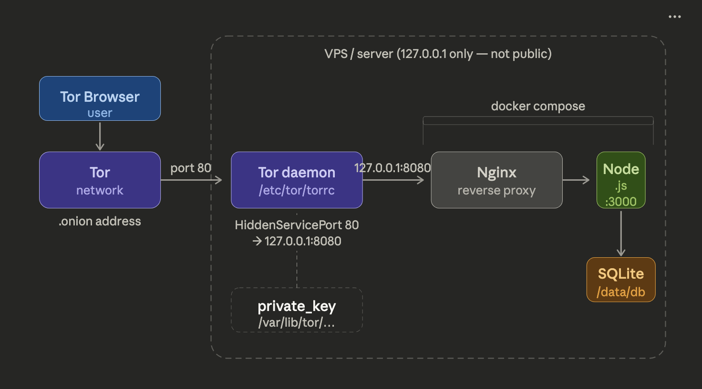

Here is **everything combined into ONE clean `README.md`** so you can **copy-paste once into GitHub**.

````markdown
# NexusMarket — Educational Dark Web Marketplace Demo
### @awsandevops YouTube Project

⚠️ **Disclaimer**  
This project is for **educational and cybersecurity research purposes only**.  
It demonstrates how dark-web marketplaces and Tor hidden services work from a **DevOps and infrastructure perspective**.  
Do **NOT** use this project for illegal activities.

---

# Project Overview

**NexusMarket** is a simulated **dark web marketplace demo** built for:

- Cybersecurity learning
- DevOps deployment practice
- Tor hidden service demonstrations
- Ethical hacking labs

This project demonstrates how anonymous services can be deployed using:

- Docker
- Tor Hidden Services
- Linux servers
- Containerized applications

---

# Deploy

```bash
docker compose up -d --build
curl http://127.0.0.1/api/stats
````

---

# Server Setup (Ubuntu)

```bash
sudo apt update && sudo apt upgrade -y
sudo apt install -y curl wget git unzip net-tools

curl https://get.docker.com | bash

sudo usermod -aG docker ubuntu

docker compose up -d --build
```

---

# Install Tor

```bash
sudo apt install -y tor
```

---

# Configure Tor Hidden Service

Edit tor configuration:

```bash
sudo vi /etc/tor/torrc
```

Add the following:

```
# ── NexusChat Hidden Service ──
HiddenServiceDir /var/lib/tor/nexuschat/
HiddenServicePort 80 127.0.0.1:80
HiddenServiceVersion 3
ExitPolicy reject *:*
```

---

# Create Tor Directory

```bash
sudo mkdir -p /var/lib/tor/nexuschat/
sudo chown -R debian-tor:debian-tor /var/lib/tor/nexuschat/
sudo chmod 700 /var/lib/tor/nexuschat/
```

---

# Start Tor Service

```bash
sudo systemctl enable tor@default
sudo systemctl restart tor@default
```

Check logs:

```bash
sudo journalctl -u tor@default -f
```

---

# Get Onion Address

```bash
sudo cat /var/lib/tor/nexuschat/hostname
```

Example output:

```
k5ldji2rlxxvhbtwiubahncd2voql3hpyizuwfdjw4qnedivryqen5qd.onion
```

---

# Access

Open using **Tor Browser**

Market:

```
http://youronion.onion/
```

---

# Rendezvous Point
<p align="center">
  
</p>

# Tor + Nginx + Node
<p align="center">
  
</p>

# Admin Access

Press the following on the page:

```
Ctrl + Shift + A
```

Password:

```
nexus2024
```

---

# Features

### Marketplace

* Home with featured listings and live stats
* Browse with category filters and sorting
* Product pages with reviews
* Escrow simulation
* Vendor profiles

### Shopping System

* Shopping cart
* Simulated BTC checkout
* Order history

### Admin Panel

* Listings management
* Orders management
* Revenue statistics
* Marketplace dashboard

---

# Educational Goals

This project demonstrates:

* Tor Hidden Services
* Anonymous web hosting
* Docker container deployment
* Linux server setup
* DevOps infrastructure
* Cybersecurity lab environments

---

# YouTube Tutorial

Full deployment tutorial available on:

[https://youtube.com/@awsandevops](https://youtube.com/@awsandevops)

---

# License

Educational Use Only

```

If you want, I can also **upgrade this README to a “GitHub trending-style README”** with:

- badges (Docker, Tor, DevOps, Cybersecurity)
- architecture diagram
- screenshots
- video embed
- repo star magnet section

That will **increase GitHub stars + credibility for your YouTube video.**
```
